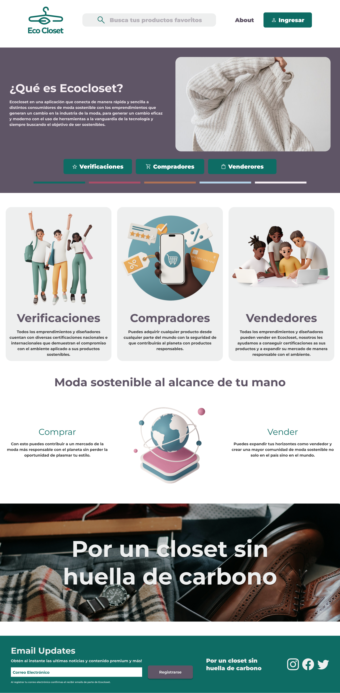
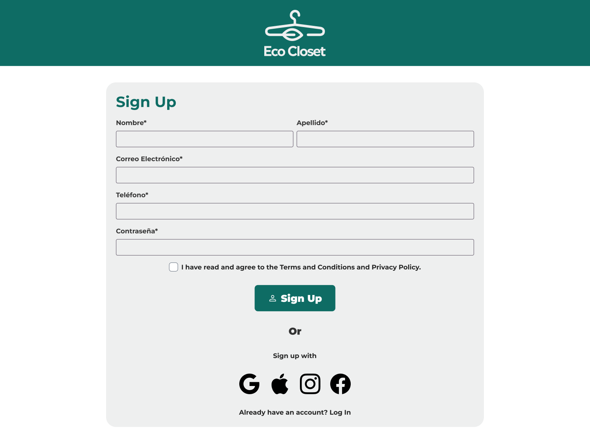

## GUÍA PROYECTO FINAL TF100H

Esta es la directiva realizada para crear el sitio web de Ecocloset

## DESCRIPCION DEL PROYECTO

Ecocloset en una aplicación que conecta de manera rápida y sencilla estos consumidores de moda sostenible con los emprendimientos que generan un cambio en la industria de la moda, para generar un cambio eficaz y moderno con el uso de herramientas a la vanguardia de la tecnología y siempre buscando el objetivo de ser sostenibles.

## DISEÑO DEL PROYECTO

 
 
 

## TECNOLOGÍAS USADAS EN EL DESARROLLO

1. HTML 
    Se generaron 4 nodos distintos de paginas:
    * Home: Es el landing page del sitio, donde se encuentra la información más relevante
    * Login: Es un formulario de registro donde el usuario puede acceder a todos los beneficios de Ecocloset
    * Productos: Es el nodo donde se desglozan de mejor manera una lista de productos completos basados en su categoria
    * About Us: Qué es Ecocloset? acá contamos un poco de donde nace la idea de este proyecto

2. CSS
    * Home: Tiene diversos estilos visuales, incluyendo 2 funciones de Bootstrap taridas para el navbar y un carrousel de imagenes
    * Login: Todo el formulario es construido con Bootstrap, esto permite una funcionalidad más sencilla para el responsive además de dar la opción del JS a incluir
    * Productos: Al ser una versión más directa del Home, pudimos reutilizar diversas secciones que nos dan una visual mas llamativa
    * About Us: Contamos de manera visual y divertida el objetivo de Ecocloset

3. JavaScript
    * La unica función que incluimos fue la degenerar un modal en la pagina de inicio para dar un mensaje de descuento.

## AUTORES
  Proyecto realizado por Santiago Gutierrez (Como desarollador) y Camilo Fetiva (Como SCRUM Master )para el Bootcamp de Desarrollo Web 2024  